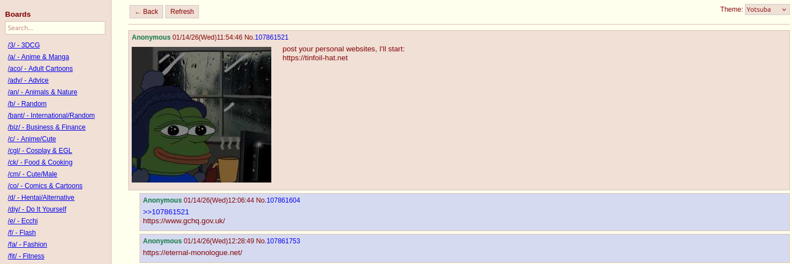

# 4chan Viewer (Pure HTML/JS)

A clean, modern, single-file **4chan browser** written in vanilla HTML + CSS + JavaScript.

No build tools, no frameworks, no backend — just open the HTML file in your browser.

Works best on desktop; mobile support is basic but usable.

## Features

### v2.0 (current)
- Three themes: **Yotsuba**, **Yotsuba B**, **Tomorrow (dark)**
- Persistent theme selection (saved in localStorage)
- Board search/filter in sidebar
- Catalog view with lazy-loaded thumbnails
- Thread view with proper greentext, quoting, image expansion
- Hover image preview (shows full image on mouseover thumbnail)
- Lazy loading of images using IntersectionObserver
- "Back to catalog" + "Refresh thread" buttons
- Scroll-to-top button
- DNS prefetch & preconnect hints for faster loading
- Hover prefetch for catalog → thread JSON (faster thread opening)
- Cleaner post formatting & spacing
- Mobile-friendly layout adjustments

### v1.0 (initial release 2025)
- Basic board list in sidebar
- Catalog view
- Thread view with clickable post numbers
- Greentext highlighting
- Quote linking (click >>123 jumps to post)
- Image hover preview (very basic)
- Tree view toggle (very experimental / buggy)

## Changelog

### 2.0.0 (2026)
- Complete UI/UX overhaul — closer to real 4chan look & feel
- Added proper theme support (Yotsuba / Yotsuba B / Tomorrow dark)
- Theme selector + persistence via localStorage
- Improved catalog: better grid, stats, title fallback
- Lazy image loading with IntersectionObserver
- Hover-to-load full image preview (much larger & smoother)
- Prefetching thread JSON when hovering catalog items
- Board search input
- Scroll-to-top button
- Better mobile layout
- Cleaner CSS variables & structure
- Removed broken tree-view mode
- Many small formatting & quoting fixes

### 1.0.0 (initial)
- First working version
- Board list
- Catalog view
- Thread view
- Basic greentext & quoting
- Very simple image hover preview
- Experimental (buggy) tree view toggle

**Note:** This viewer uses a public CORS proxy (`api.codetabs.com`).  
If it stops working or is slow, you may replace the `PROXY` constant with another proxy or (better) host your own tiny proxy.

## Limitations & Known Issues

- Relies on third-party CORS proxy → may be rate-limited or go down
- No posting / captcha support (viewer only)
- No websocket live updates (refresh manually)
- Very long threads can be slow to render
- Some very exotic 4chan HTML features are not perfectly supported
- Image hover preview can feel laggy on very slow connections

## Possible future improvements

- Option to use official 4chan JSON without proxy (if browser allows)
- Better error handling / offline fallback
- Watch thread (periodic auto-refresh)
- Reply preview / quote chain navigation
- Keyboard shortcuts
- More themes (Tomorrow Night, Dark Mono, etc.)
- Remember last visited board/thread
- Catalog sort options

## Legal

This is a **client-side viewer** only — it does **not** host, store, or modify any 4chan content.

All data comes directly from `a.4cdn.org` and `i.4cdn.org`.

Respect the 4chan [terms of service](https://www.4chan.org/rules).

## License

MIT

---

Made with vanilla JS • 2025
